# Cortex-ARM Learning

Cortex-ARM Learning is a VSCode Debugger extension intended to be used with ARM Assembly Language programs. 

The debugger is built off of the existing extension [Cortex Debug](https://marketplace.visualstudio.com/items?itemName=marus25.cortex-debug).

Cortex-ARM Learning is equipt with additional UI features that will aid early-stage programmers with the learning of Assembly Langugage and the concepts that are involved. 

## Features

### Build Button
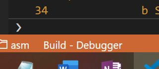

Build button can be found on the bottom left of the Status Bar of your VSCode Window. 

```
Note: the button will only appear once the debugger is activated but will remain when debugger is exited.
```

#### Build Button Functionality
Builds your ARM Project. Any errors in your ARM code, found in your main.s file, will appear here. Once the project has built the project is ready to be debugged.

### Register View
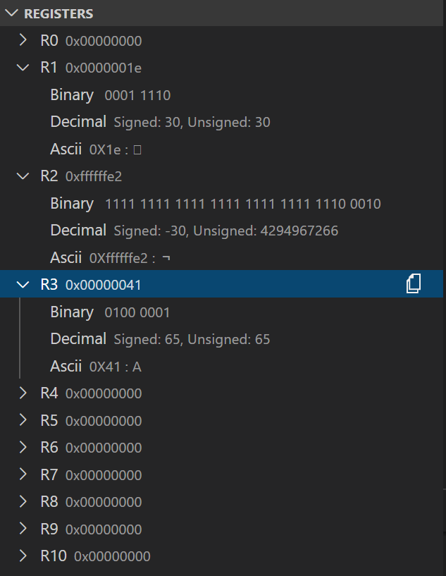

The register window appears once you are debugging. It shows the values of all registers avaliable to ARM. 

#### Register View Functionality
Shows the values of the register in:
- Hexidecimal (default)
- Binary
- Decimal
    - Signed: Using two's complement
    - Unsigined
- Ascii Character

### Performance Counter

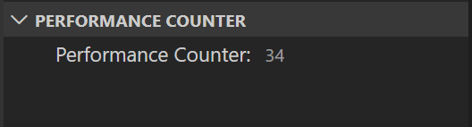

The performance counter can be found in the left-side window along with the register view. It shows the current cost of the program,in main.s, in instruction cycles. 

### Stack Interface

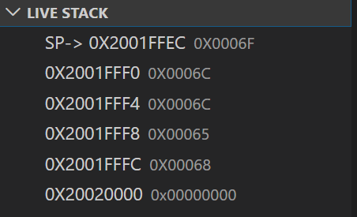

The stack interface window appears once you are debugging. Once initialised, the current Stack Pointer {SP} is shown at the top of the stack.

#### Stack Functionality
Following the live stack pointer, any values that are pushed onto or popped off of the stack, their memory values are shown. While the current stack pointer is pointed to. 
```
Note: The stack window physically grows upwards when pushed onto, but note that the stack pointer value is decreasing in value.
```

### Array Interface

Ctrl + Shift + P to open commands.

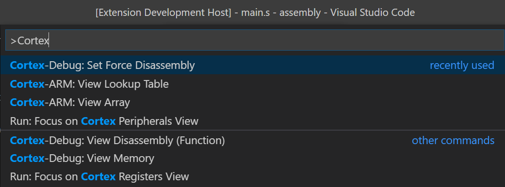

Selecting Cortex-ARM Array command

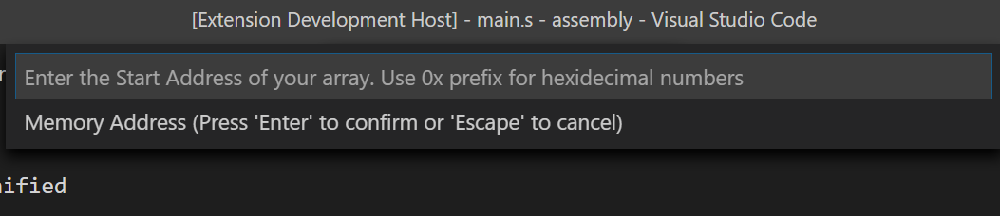

Enter the hexidecimal start address of the array. Example:

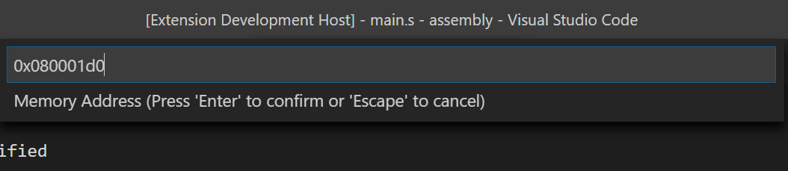

Enter the element size of the elements of your array. 

- Byte - indicating your array is filled of byte size values = 1 byte = 8 bits.
- Halfword - indicating your array is filled of halfword size values = 2 bytes = 16 bits
- Word (default) - indicating your array is filled of word size values = 4 bytes = 32 bits

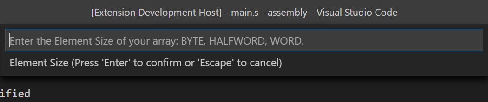

Example:

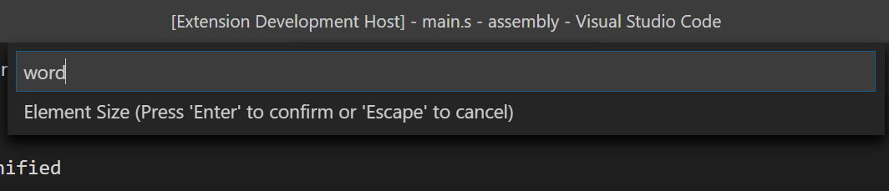

Enter the dimensions of your array. Like a standard high-level language array where; array[i,j]. Enter your array ny number of rows followed by a comma, followed by the number of columns.

```
Note: If your are working with a 1-D array just input one number: the length of the array.
```

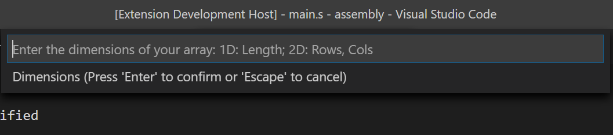

Example where array = [5,4]

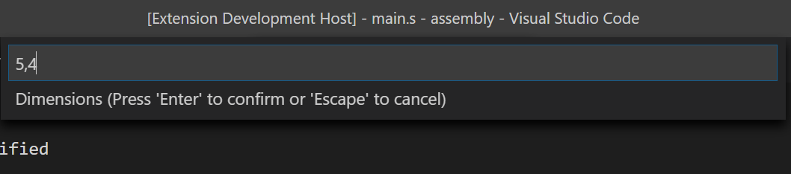

Enter how you would like the values of the array to be displayed. For decimal numbers, you can view in decimal. For a word, you can view in ascii.

- Heximdecimal (default) - eg. 0x0000000C
- Binary - eg. 1110
- Decimal - eg. 12
- Ascii - eg. 0x68 = 'h'

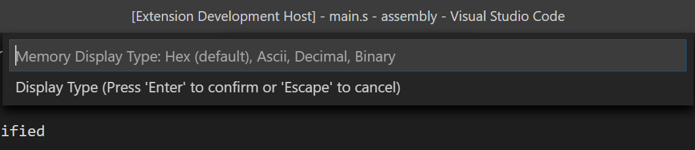

Example:

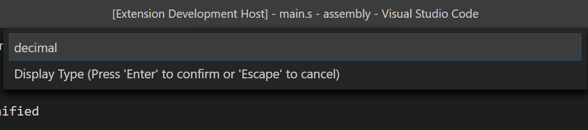

Result:

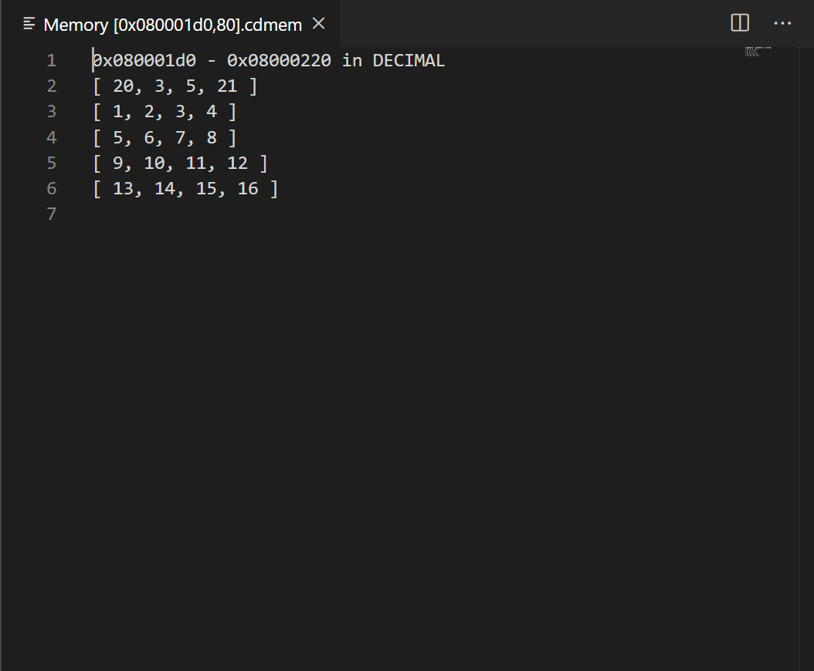

### Reference Table

This opens a text document that holds:
- ARM instructions
- Ascii Table

### Other
These features are all in addition to the already existing features of the debugger which include the following:

- Memory Access
- Diassembly Window 

## Setup

### VS Code

Install this extension. 

Ctrl + Shift + P to open commands. 
- Find: Open Settings (JSON). 
- Open Settings.JSON file.
- Add the following settings. 
```
"cortex-debug.armToolchainPath": "${env:VSARM}\\armcc\\bin\\",
"cortex-debug.JLinkGDBServerPath": "${env:VSARM}\\JLink\\JLinkGDBServer.exe"
```

### ARM Assembly Project File

Use [CortexARM Project File](https://github.com/jordanbent/CortexARM-ProjectFile) when creating your project file to debug. Edit only the main.s file.

### Environment

To setup your VSCode to be able to run Assembly Code through a board. Further documentation can be found at this [tutorial](https://hbfsrobotics.com/blog/configuring-vs-code-arm-development-stm32cubemx).

#### VSARM Folder

Create a folder in your C drive: 'C:', named VSARM to hold all downloads in the same directory.

#### GNU Toolchain

This is our compiler to use to compile ARM Assembly Code. 

Download file indicated [gcc-arm-none-eabi-9-2019-q4-major-win32.exe](https://developer.arm.com/tools-and-software/open-source-software/developer-tools/gnu-toolchain/gnu-rm/downloads)

```
Note: Download file to C:\VSARM.
```
Rename download foler, in C:\VSARM, to: armcc.

Then in your command line run the following command:
```bash
C:\>setx PATH "C:\VSARM\armcc\bin"
```
```
Note: The command is run while the current dierctory is C:
```

#### STLink to JLink

STLink and JLink are linka to communicate between your board and your computer. Some STM32 boards are inbuilt with STLink, but we nned to change it to JLink.

Flash board to be used with JLink rather than STLink using [STLink Reflash](https://www.segger.com/downloads/jlink#STLink_Reflash). Using option (1)Upgrade to JLink.

Download [J-Link Software and Documentation Pack](segger.com/downloads/jlink/#J-LinkSoftwareAndDocumentationPack)
```
Note: Download file to C:\VSARM.
```

### Board
```
Currently Setup for STM32F411 Cortex M-4 core.
```

If have a different version of the board, find .svd file and all to .ignore file and in vscode folder change launch file for project.

## Contributing
Pull requests are welcome. 

## Acknowledgments
This extension is built upon Marcus's (marcus25) Cortex Debug extension (https://marketplace.visualstudio.com/items?itemName=marus25.cortex-debug). His project provided an excellent debugger.